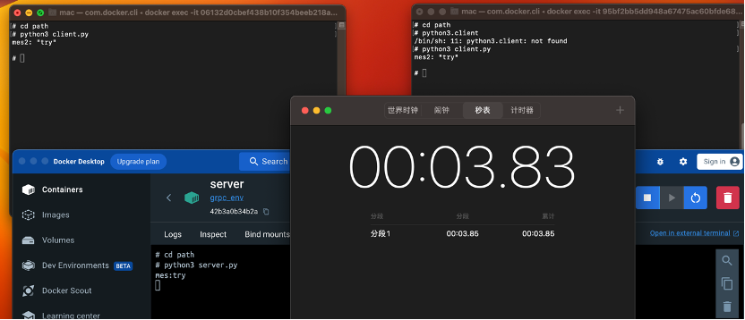

# 基于 docker 的 grpc 订阅系统

我们首先通过以下的命令创建一个基础的 ubuntu 容器

```
docker pull ubuntu:18.04//拉镜像
docker run --name ubuntu1 -it -v /Users/mac/Documents/volume:/path ubuntu:18.04
```

然后在容器内使用以下命令安装 python3 并通过 pip3 安装 grpc

```
apt update
apt install python3
apt install python3-pip3
pip3 install grpcio-tools
```

这里我们的 grpc 环境搭建好了,然后通过下面命令生成镜像再创建几个对应的客户端和服务端

```
docker commit ubuntu1 grpc_env
docker run --name client1 -it -v /Users/mac/Documents/volume:/path grpc_env
docker run --name client2 -it -v /Users/mac/Documents/volume:/path grpc_env
docker run --name server -it -v /Users/mac/Documents/volume:/path grpc_env
```

接下来需要将这几台机器放到同一个网络里(也可以试着互相 ping,能 ping 通就不需要管这一步)

```
docker network create mynetwork
docker network connect mynetwork server
docker network connect mynetwork client1
docker network connect mynetwork client2
```

接着是文件的编写,我在创建容器的时候已经挂载了卷,将文件直接放入即可.包括一份.proto 文件,一份 server.py 和一份 client.py
这里的 proto 文件可以用来定义消息类型,其中可以定义储存时间的字段,我设置为 10s
int32 storage_time_seconds = 2; // 存储时间字段
运行下面代码可以使用 grpc 生成对应的库函数

```
python3 -m grpc_tools.protoc -I=./ --python_out=./ --grpc_python_out=./ ./pubsub.proto
```

准备工作完成,分别运行客户端和服务端即可通信


我将自己的配置好grpc环境的docker镜像打包上docker hub了,可以通过以下指令拉取
```
docker pull lvyezhen/img:grpc_env
```
